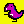
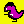
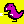
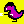

# NFT image generator

A simple image generator that iterates through base image collections in the in/ folder and for each base image replaces colors according to defined palettes, followed by recursively applying optional accessories. The result is dumped to the out/ folder.

For example, given the base image 

Accessories  

And defined palettes (./palette.py)
```
	Palette("pink-on-yellow", (241,249,2), (201,0,181), (71,2,64))	
```

It'll generate
   

## Assumptions and limitations
The color replacement is very basic, it assumes **5 colors only** in the base image: background color, main fill color, shade, reflection and outline.
- Reflection is always white and isn't replaced.
- Outline must be black and stays black.
- Background color is probed from the pixel (0,0).
- Shade color is the color that is the color of the first pixel after outline going from left to right.
- Main fill color is whatever isn't shade, reflection, outline or backcolor.

All other colors are ignored.

Palettes are defined in palette.py as a triad (background-color-RGB), (main-fill-color-RGB), (shade-color-RGB)

Folder structure in in/ matters, folder names don't.

Accessories images must be PNG's with transparent background, same resolution as the base image. They're simply overlayed on top of the base image.

## Prerequisites
python 2.7 or higher

## Usage
```
pip install Pillow
pip install numpy
python ./main.py
```

See in/ and out/ for example